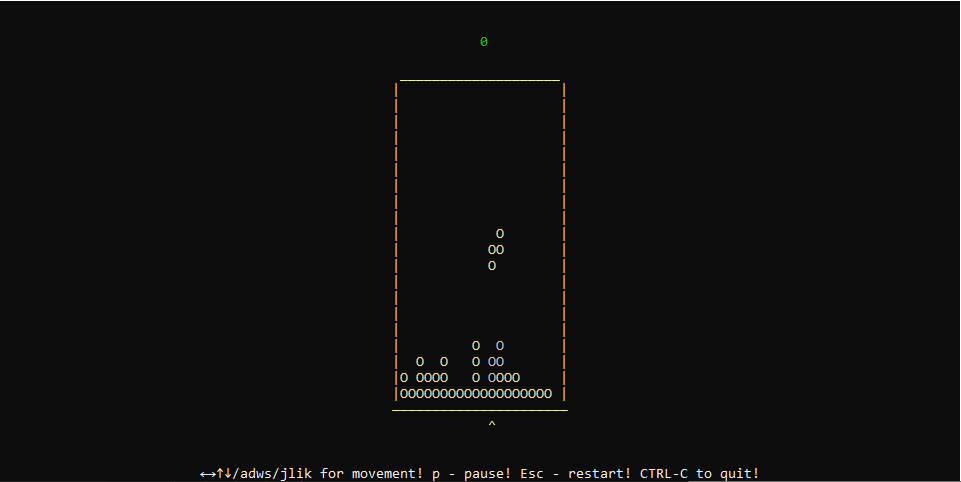

 # Tetris by Muhing

> to use the single player game, you need to execute the command ```tetris```



> to use the single player game, you need to execute the command ```tetris online <name> <server-host>```. Default server-host ws://127.0.0.1:8080.

